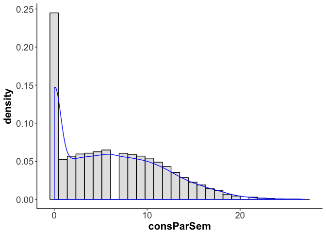

Exemple d'analyse DD avec les données simulées créé pour ce chapitre. La base de données contient des données sur 20,000 personnes échantillonnées dans 20 états dans une paye fictive. Nous avons aussi créé une variable province pour délimiter des régions géographiques plus importantes que les états. Il y a 3 provinces dans notre pays fictif.

Le code pour cette analyse est basé sur le [Guide de Style R](https://google.github.io/styleguide/Rguide.xml) créé par Google avec quelques modifications pour faciliter l'utilisation du fichier sous R et Stata. 

Les variables dans la base de données sont les suivantes: 

1. **etatID** : l'identificateur de l'état
2. **individuID** : l'identificateur de l'individu
3. **connaissance** : connaisance de l'individu au sujet de la connsomation
4. **effetTemps** : une variable qui indique l'année
5. **age** : l'âge du répondant
6. **loi** : indique si l'état à implanté la loi
7. **consParSem** : le nombre de consommations par semaine
8. **region** : la region 

### Importer les données


```r
library(broom)
library(ggplot2)
library(MASS)
library(doBy)
dd <- read.csv("did.csv")
```
### Statistiques descriptives par état et temps


```r
## Un fonction pour calculer la moyenne, la déviance standard, et la nombre individu
sumFun <- function(x, ...){
  c(m=mean(x, ...), Stand_Dev=sd(x, ...))}

### Nombre de consommation par état en moyenne dans le temps 2010 et 2011 

ddDesc <- summaryBy(consParSem ~ etatID*effetTemps, data = dd, FUN = sumFun, na.rm=TRUE)
print(head(ddDesc))
```

```
##   etatID effetTemps consParSem.m consParSem.Stand_Dev
## 1      1       2009         8.68                 4.81
## 2      1       2010         8.53                 4.78
## 3      1       2011         8.48                 4.75
## 4      1       2012         7.97                 4.75
## 5      2       2009         8.96                 4.81
## 6      2       2010         9.72                 4.99
```

```r
### Moyenne du nombre de consommations par semaine 

summaryBy(consParSem ~ loi, data = dd, FUN = sumFun, na.rm=TRUE)
```

```
##   loi consParSem.m consParSem.Stand_Dev
## 1   0         9.27                 4.98
## 2   1         3.06                 3.67
```

```r
### Moyenne du nombre de consommations par semaine par province

summaryBy(consParSem ~ effetTemps*region, data = dd, FUN = sumFun, na.rm=TRUE)
```

```
##    effetTemps  region consParSem.m consParSem.Stand_Dev
## 1        2009 region1         9.64                 4.88
## 2        2009 region2         6.00                 5.23
## 3        2009 region3         3.19                 3.69
## 4        2010 region1         9.76                 5.00
## 5        2010 region2         6.32                 5.32
## 6        2010 region3         3.30                 3.88
## 7        2011 region1         9.65                 4.98
## 8        2011 region2         6.33                 5.52
## 9        2011 region3         3.36                 3.94
## 10       2012 region1         9.27                 4.83
## 11       2012 region2         6.07                 5.27
## 12       2012 region3         3.06                 3.63
```

### Regression


```r
### Examination de la distribution de la variable dépendante. 

ddFig1 <- ggplot(dd, aes(x=consParSem)) + 
          geom_histogram(aes(y = ..density..), fill = "dark grey", colour = "black", 
                         alpha = 1/3, size = 0.5) +
          geom_density(colour = "blue") + 
          theme(axis.line = element_line(colour = "black"),
          panel.grid.major = element_blank(),
          panel.grid.minor = element_blank(),
          panel.border = element_blank(),
          panel.background = element_blank(),
          axis.title=element_text(size=16,face="bold"),
          axis.text=element_text(size=14))
plot(ddFig1)
```

<!-- -->

```r
### Nous allons utiliser une régression binomiale négative pour modéliser 
### l'effet de l'intervention

### Modèle 1 : Variable de temps incluse comme facteur
m1 <- glm.nb(consParSem ~ factor(loi), data=dd)
summary(m1)
```

```
## 
## Call:
## glm.nb(formula = consParSem ~ factor(loi), data = dd, init.theta = 1.49225072, 
##     link = log)
## 
## Deviance Residuals: 
##    Min      1Q  Median      3Q     Max  
## -2.428  -1.314  -0.162   0.409   3.004  
## 
## Coefficients:
##              Estimate Std. Error z value Pr(>|z|)    
## (Intercept)   2.22675    0.00882   252.4   <2e-16 ***
## factor(loi)1 -1.10765    0.01332   -83.2   <2e-16 ***
## ---
## Signif. codes:  0 '***' 0.001 '**' 0.01 '*' 0.05 '.' 0.1 ' ' 1
## 
## (Dispersion parameter for Negative Binomial(1.49) family taken to be 1)
## 
##     Null deviance: 31996  on 19999  degrees of freedom
## Residual deviance: 25170  on 19998  degrees of freedom
## AIC: 110264
## 
## Number of Fisher Scoring iterations: 1
## 
## 
##               Theta:  1.4923 
##           Std. Err.:  0.0237 
## 
##  2 x log-likelihood:  -110257.7950
```

```r
confint(m1)
```

```
##              2.5 % 97.5 %
## (Intercept)   2.21   2.24
## factor(loi)1 -1.13  -1.08
```

```r
### Modèle 2 : Variable de temps et effet 
m2 <- glm.nb(consParSem ~ factor(loi) + factor(effetTemps), data=dd)
summary(m2)
```

```
## 
## Call:
## glm.nb(formula = consParSem ~ factor(loi) + factor(effetTemps), 
##     data = dd, init.theta = 1.494257969, link = log)
## 
## Deviance Residuals: 
##    Min      1Q  Median      3Q     Max  
## -2.442  -1.305  -0.123   0.456   2.959  
## 
## Coefficients:
##                        Estimate Std. Error z value Pr(>|z|)    
## (Intercept)              2.2146     0.0145  153.17   <2e-16 ***
## factor(loi)1            -1.1080     0.0133  -83.21   <2e-16 ***
## factor(effetTemps)2010   0.0362     0.0187    1.94    0.053 .  
## factor(effetTemps)2011   0.0364     0.0187    1.95    0.051 .  
## factor(effetTemps)2012  -0.0245     0.0187   -1.31    0.192    
## ---
## Signif. codes:  0 '***' 0.001 '**' 0.01 '*' 0.05 '.' 0.1 ' ' 1
## 
## (Dispersion parameter for Negative Binomial(1.49) family taken to be 1)
## 
##     Null deviance: 32021  on 19999  degrees of freedom
## Residual deviance: 25173  on 19995  degrees of freedom
## AIC: 110255
## 
## Number of Fisher Scoring iterations: 1
## 
## 
##               Theta:  1.4943 
##           Std. Err.:  0.0237 
## 
##  2 x log-likelihood:  -110242.6470
```

```r
confint(m2)
```

```
##                            2.5 %  97.5 %
## (Intercept)             2.186364  2.2429
## factor(loi)1           -1.134143 -1.0819
## factor(effetTemps)2010 -0.000419  0.0728
## factor(effetTemps)2011 -0.000190  0.0730
## factor(effetTemps)2012 -0.061181  0.0122
```

```r
### Modèle 3 : Variable de temps, effet individuel, et les états comme effet fixe 
### (c.-à-d.. une variable dichotomique pour chaque état)  
m3 <- glm.nb(consParSem ~ factor(loi) + factor(effetTemps) + factor(etatID), data=dd)
summary(m3)
```

```
## 
## Call:
## glm.nb(formula = consParSem ~ factor(loi) + factor(effetTemps) + 
##     factor(etatID), data = dd, init.theta = 1.673012678, link = log)
## 
## Deviance Residuals: 
##    Min      1Q  Median      3Q     Max  
## -2.613  -1.306  -0.153   0.453   3.670  
## 
## Coefficients: (1 not defined because of singularities)
##                        Estimate Std. Error z value Pr(>|z|)    
## (Intercept)              2.1234     0.0289   73.48  < 2e-16 ***
## factor(loi)1            -0.3168     0.0384   -8.24  < 2e-16 ***
## factor(effetTemps)2010   0.0266     0.0180    1.48  0.13845    
## factor(effetTemps)2011   0.0356     0.0180    1.98  0.04774 *  
## factor(effetTemps)2012  -0.0355     0.0181   -1.97  0.04904 *  
## factor(etatID)2          0.1251     0.0377    3.32  0.00090 ***
## factor(etatID)3          0.0914     0.0377    2.42  0.01534 *  
## factor(etatID)4          0.2570     0.0375    6.85  7.3e-12 ***
## factor(etatID)5          0.1459     0.0376    3.88  0.00011 ***
## factor(etatID)6          0.1403     0.0377    3.73  0.00019 ***
## factor(etatID)7         -0.0223     0.0379   -0.59  0.55538    
## factor(etatID)8          0.2260     0.0375    6.02  1.7e-09 ***
## factor(etatID)9         -0.0707     0.0380   -1.86  0.06262 .  
## factor(etatID)10         0.0209     0.0378    0.55  0.58117    
## factor(etatID)11        -0.7734     0.0414  -18.69  < 2e-16 ***
## factor(etatID)12        -0.7857     0.0414  -18.96  < 2e-16 ***
## factor(etatID)13        -0.9336     0.0421  -22.17  < 2e-16 ***
## factor(etatID)14        -0.5556     0.0405  -13.71  < 2e-16 ***
## factor(etatID)15        -0.7212     0.0412  -17.52  < 2e-16 ***
## factor(etatID)16        -0.9033     0.0420  -21.52  < 2e-16 ***
## factor(etatID)17        -0.9742     0.0423  -23.02  < 2e-16 ***
## factor(etatID)18        -0.6319     0.0408  -15.48  < 2e-16 ***
## factor(etatID)19        -1.1764     0.0434  -27.08  < 2e-16 ***
## factor(etatID)20             NA         NA      NA       NA    
## ---
## Signif. codes:  0 '***' 0.001 '**' 0.01 '*' 0.05 '.' 0.1 ' ' 1
## 
## (Dispersion parameter for Negative Binomial(1.67) family taken to be 1)
## 
##     Null deviance: 34217  on 19999  degrees of freedom
## Residual deviance: 25462  on 19977  degrees of freedom
## AIC: 109060
## 
## Number of Fisher Scoring iterations: 1
## 
## 
##               Theta:  1.6730 
##           Std. Err.:  0.0277 
## 
##  2 x log-likelihood:  -109012.4250
```

```r
confint(m3)
```

```
##                            2.5 %   97.5 %
## (Intercept)             2.067072  2.18018
## factor(loi)1           -0.392209 -0.24150
## factor(effetTemps)2010 -0.008614  0.06190
## factor(effetTemps)2011  0.000341  0.07084
## factor(effetTemps)2012 -0.070897 -0.00016
## factor(etatID)2         0.051277  0.19899
## factor(etatID)3         0.017507  0.16538
## factor(etatID)4         0.183470  0.33049
## factor(etatID)5         0.072098  0.21967
## factor(etatID)6         0.066526  0.21414
## factor(etatID)7        -0.096616  0.05193
## factor(etatID)8         0.152432  0.29961
## factor(etatID)9        -0.145128  0.00373
## factor(etatID)10       -0.053285  0.09502
## factor(etatID)11       -0.854576 -0.69235
## factor(etatID)12       -0.866984 -0.70455
## factor(etatID)13       -1.016180 -0.85108
## factor(etatID)14       -0.635052 -0.47614
## factor(etatID)15       -0.801971 -0.64059
## factor(etatID)16       -0.985566 -0.82104
## factor(etatID)17       -1.057240 -0.89134
## factor(etatID)18       -0.711960 -0.55197
## factor(etatID)19       -1.261677 -1.09133
## factor(etatID)20              NA       NA
```

```r
### Modèle 4 : Variable de temps, effet individuel, états, et variables individuelles
m4 <- glm.nb(consParSem ~ factor(loi) + factor(effetTemps) + factor(etatID) 
             + connaisance + age, data=dd)
summary(m4)
```

```
## 
## Call:
## glm.nb(formula = consParSem ~ factor(loi) + factor(effetTemps) + 
##     factor(etatID) + connaisance + age, data = dd, init.theta = 1.673233204, 
##     link = log)
## 
## Deviance Residuals: 
##    Min      1Q  Median      3Q     Max  
## -2.617  -1.301  -0.146   0.453   3.686  
## 
## Coefficients: (1 not defined because of singularities)
##                         Estimate Std. Error z value Pr(>|z|)    
## (Intercept)             2.137676   0.058716   36.41  < 2e-16 ***
## factor(loi)1           -0.317162   0.038440   -8.25  < 2e-16 ***
## factor(effetTemps)2010  0.026773   0.017982    1.49  0.13651    
## factor(effetTemps)2011  0.035558   0.017977    1.98  0.04792 *  
## factor(effetTemps)2012 -0.035170   0.018050   -1.95  0.05136 .  
## factor(etatID)2         0.124769   0.037674    3.31  0.00093 ***
## factor(etatID)3         0.091145   0.037717    2.42  0.01567 *  
## factor(etatID)4         0.256902   0.037501    6.85  7.4e-12 ***
## factor(etatID)5         0.145374   0.037641    3.86  0.00011 ***
## factor(etatID)6         0.140652   0.037653    3.74  0.00019 ***
## factor(etatID)7        -0.023073   0.037891   -0.61  0.54257    
## factor(etatID)8         0.225685   0.037540    6.01  1.8e-09 ***
## factor(etatID)9        -0.070921   0.037969   -1.87  0.06178 .  
## factor(etatID)10        0.021079   0.037826    0.56  0.57735    
## factor(etatID)11       -0.773919   0.041382  -18.70  < 2e-16 ***
## factor(etatID)12       -0.786549   0.041437  -18.98  < 2e-16 ***
## factor(etatID)13       -0.933762   0.042116  -22.17  < 2e-16 ***
## factor(etatID)14       -0.555890   0.040536  -13.71  < 2e-16 ***
## factor(etatID)15       -0.721696   0.041164  -17.53  < 2e-16 ***
## factor(etatID)16       -0.903035   0.041970  -21.52  < 2e-16 ***
## factor(etatID)17       -0.974761   0.042321  -23.03  < 2e-16 ***
## factor(etatID)18       -0.631932   0.040812  -15.48  < 2e-16 ***
## factor(etatID)19       -1.176733   0.043448  -27.08  < 2e-16 ***
## factor(etatID)20              NA         NA      NA       NA    
## connaisance            -0.003365   0.002127   -1.58  0.11359    
## age                    -0.000692   0.002506   -0.28  0.78249    
## ---
## Signif. codes:  0 '***' 0.001 '**' 0.01 '*' 0.05 '.' 0.1 ' ' 1
## 
## (Dispersion parameter for Negative Binomial(1.67) family taken to be 1)
## 
##     Null deviance: 34219  on 19999  degrees of freedom
## Residual deviance: 25461  on 19975  degrees of freedom
## AIC: 109062
## 
## Number of Fisher Scoring iterations: 1
## 
## 
##               Theta:  1.6732 
##           Std. Err.:  0.0277 
## 
##  2 x log-likelihood:  -109009.8520
```

```r
confint(m4)
```

```
##                            2.5 %    97.5 %
## (Intercept)             2.023269  2.252297
## factor(loi)1           -0.392522 -0.241813
## factor(effetTemps)2010 -0.008482  0.062029
## factor(effetTemps)2011  0.000311  0.070806
## factor(effetTemps)2012 -0.070540  0.000199
## factor(etatID)2         0.050917  0.198624
## factor(etatID)3         0.017215  0.165078
## factor(etatID)4         0.183396  0.330412
## factor(etatID)5         0.071591  0.219159
## factor(etatID)6         0.066849  0.214458
## factor(etatID)7        -0.097348  0.051202
## factor(etatID)8         0.152102  0.299272
## factor(etatID)9        -0.145349  0.003504
## factor(etatID)10       -0.053073  0.095231
## factor(etatID)11       -0.855071 -0.692840
## factor(etatID)12       -0.867808 -0.705367
## factor(etatID)13       -1.016362 -0.851268
## factor(etatID)14       -0.635365 -0.476458
## factor(etatID)15       -0.802417 -0.641041
## factor(etatID)16       -0.985344 -0.820824
## factor(etatID)17       -1.057768 -0.891868
## factor(etatID)18       -0.711952 -0.551963
## factor(etatID)19       -1.261995 -1.091644
## factor(etatID)20              NA        NA
## connaisance            -0.007545  0.000814
## age                    -0.005582  0.004198
```


