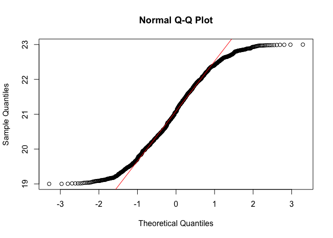

Exemple d'analyse RD avec les données simulées créé pour ce chapitre. La base de données contient des données sur 1,000 personnes âgées de 19 à 23 ans.

Le code pour cette analyse est basé sur le [Guide de Style R](https://google.github.io/styleguide/Rguide.xml) créé par Google avec quelques modifications pour faciliter l'utilisation du fichier sous R et Stata. 

Les variables dans la base de données sont les suivantes: 

1. **id**: l’identificateur unique pour les répondants.
2. **age** : une variable qui indique l’âge du répondant.
3. **propAlcJour** : nombre de consommation d’alcool par jour du répondant.
4. **fruit** : consommation de fruit et légume par semaine.
5. **cigarette** : consommation de cigarette par semaine.
6. **propAlcJour** : le nombre de consommations par semaine

### Importer les données


```r
library(knitr)
library(ggplot2)
library(rdrobust)
library(extrafont)
library(doBy)
library(rdrobust)

rd <- read.csv("rd.csv")
```

### 3. Vérifier que la variable « assignment » est continue et mesurée précisément


```r
histogramAge <- ggplot(rd, aes(age)) +
  geom_histogram(binwidth = 0.1)
plot(histogramAge)
```

<!-- -->

```r
shapiro.test(rd$age)
```

```
## 
## 	Shapiro-Wilk normality test
## 
## data:  rd$age
## W = 1, p-value <2e-16
```

```r
qqnorm(rd$age); qqline(rd$age, col = 2)
```

<!-- -->

### 4. Visualiser la variable d'assignment par la variable d'intérêt


```r
ageConsomF1_1 <- ggplot(rd, aes(x = age, y = propAlcJour)) + 
            geom_point(shape=1) + 
            geom_smooth(aes(color=factor(dAge), se=FALSE)) +
            geom_smooth(method="lm", se=FALSE, fullrange=FALSE, colour="black") + 
            theme(axis.line = element_line(colour = "black"),
                panel.background = element_blank(),
                axis.title=element_text(size=16),
                text=element_text(size=14)) + 
            xlab("Âge") +
            ylab("Consommation d'alcool par jour") + 
            scale_colour_discrete(name  ="Régression loess",
                            breaks=c("1", "0"),
                            labels=c("Avant 21", "Après 21"))
print(ageConsomF1_1)
```

<!-- -->

```r
ggsave("rdMain.jpg", ageConsomF1_1, dpi = 300)
```


```
## quartz_off_screen 
##                 2
```

### 5. Comparaison de variable d’intérêt et co-variables


```r
## Un function pour calculer la moyenne, la déviance standard, et la nombre individu
sumFun <- function(x, ...){
  c(m=mean(x, ...), Stand_Dev=sd(x, ...))}

### Nombre de consomation par état en moyenne dans le temps 2010 et 2011 

didDesc <- summaryBy(propAlcJour + fruit + cigarette ~ dAge, data = rd, FUN = sumFun, 
                     na.rm=TRUE)
print(head(didDesc))
```

```
##   dAge propAlcJour.m propAlcJour.Stand_Dev fruit.m fruit.Stand_Dev
## 1    0           4.1                  0.99     5.0             2.1
## 2    1           5.6                  1.04     5.1             2.0
##   cigarette.m cigarette.Stand_Dev
## 1         2.2                 3.1
## 2         2.0                 2.9
```

### 6. Sélectionner le « bandwidth »


```r
rdplot(y = rd$propAlcJour, x = rd$age, c=21, 
       y.label = "Nombre de consomation par jour", x.label = "Âge")
```

<!-- -->

### 7. Estimer l’effet de la politique publique par des modèles de régression


```r
## Échantillons complets
lm <- lm(propAlcJour ~ age, data=rd)
summary(lm)
```

```
## 
## Call:
## lm(formula = propAlcJour ~ age, data = rd)
## 
## Residuals:
##    Min     1Q Median     3Q    Max 
## -3.420 -0.729 -0.012  0.720  3.099 
## 
## Coefficients:
##             Estimate Std. Error t value Pr(>|t|)    
## (Intercept)  -8.0170     0.6068   -13.2   <2e-16 ***
## age           0.6136     0.0288    21.3   <2e-16 ***
## ---
## Signif. codes:  0 '***' 0.001 '**' 0.01 '*' 0.05 '.' 0.1 ' ' 1
## 
## Residual standard error: 1 on 998 degrees of freedom
## Multiple R-squared:  0.313,	Adjusted R-squared:  0.313 
## F-statistic:  455 on 1 and 998 DF,  p-value: <2e-16
```

```r
confint(lm)
```

```
##             2.5 % 97.5 %
## (Intercept) -9.21  -6.83
## age          0.56   0.67
```

```r
### Kernel Triangulaire
rdrobust(rd$propAlcJour, rd$age, c=21, kernel= "tri", deriv=0, fuzzy=NULL, all=TRUE)
```

```
## Call: rdrobust
## 
## Number of Obs.                 1000
## BW type                       mserd
## Kernel                   Triangular
## VCE method                       NN
## 
## Number of Obs.                 484         516
## Eff. Number of Obs.            142         127
## Order est. (p)                   1           1
## Order bias  (p)                  2           2
## BW est. (h)                  0.552       0.552
## BW bias (b)                  0.861       0.861
## rho (h/b)                    0.641       0.641
```

```r
rdrobust(rd$propAlcJour, rd$age, c=21, bwselect="cerrd", kernel= "tri", deriv=0, 
         fuzzy=NULL, all=TRUE)
```

```
## Call: rdrobust
## 
## Number of Obs.                 1000
## BW type                       cerrd
## Kernel                   Triangular
## VCE method                       NN
## 
## Number of Obs.                 484         516
## Eff. Number of Obs.             94          85
## Order est. (p)                   1           1
## Order bias  (p)                  2           2
## BW est. (h)                  0.391       0.391
## BW bias (b)                  0.861       0.861
## rho (h/b)                    0.454       0.454
```

```r
### Kernel Epa
rdrobust(rd$propAlcJour, rd$age, c=21, kernel="epa", deriv=0, fuzzy=NULL, all=TRUE)
```

```
## Call: rdrobust
## 
## Number of Obs.                 1000
## BW type                       mserd
## Kernel                   Epanechnikov
## VCE method                       NN
## 
## Number of Obs.                 484         516
## Eff. Number of Obs.            131         119
## Order est. (p)                   1           1
## Order bias  (p)                  2           2
## BW est. (h)                  0.518       0.518
## BW bias (b)                  0.840       0.840
## rho (h/b)                    0.617       0.617
```

```r
rdrobust(rd$propAlcJour, rd$age, c=21, bwselect="cerrd", kernel="epa", deriv=0, 
         fuzzy=NULL, all=TRUE)
```

```
## Call: rdrobust
## 
## Number of Obs.                 1000
## BW type                       cerrd
## Kernel                   Epanechnikov
## VCE method                       NN
## 
## Number of Obs.                 484         516
## Eff. Number of Obs.             90          81
## Order est. (p)                   1           1
## Order bias  (p)                  2           2
## BW est. (h)                  0.367       0.367
## BW bias (b)                  0.840       0.840
## rho (h/b)                    0.437       0.437
```

```r
### Kernel Uniforme
rdrobust(rd$propAlcJour, rd$age, c=21, kernel="uni", deriv=0, fuzzy=NULL, all=TRUE)
```

```
## Call: rdrobust
## 
## Number of Obs.                 1000
## BW type                       mserd
## Kernel                      Uniform
## VCE method                       NN
## 
## Number of Obs.                 484         516
## Eff. Number of Obs.            128         117
## Order est. (p)                   1           1
## Order bias  (p)                  2           2
## BW est. (h)                  0.509       0.509
## BW bias (b)                  0.895       0.895
## rho (h/b)                    0.569       0.569
```

```r
rdrobust(rd$propAlcJour, rd$age, c=21, bwselect="cerrd", kernel="uni", deriv=0, 
         fuzzy=NULL, all=TRUE)
```

```
## Call: rdrobust
## 
## Number of Obs.                 1000
## BW type                       cerrd
## Kernel                      Uniform
## VCE method                       NN
## 
## Number of Obs.                 484         516
## Eff. Number of Obs.             89          80
## Order est. (p)                   1           1
## Order bias  (p)                  2           2
## BW est. (h)                  0.361       0.361
## BW bias (b)                  0.895       0.895
## rho (h/b)                    0.403       0.403
```

```r
### Fruit
rdrobust(rd$fruit, rd$age, c=21, kernel= "tri", deriv=0, fuzzy=NULL, all=TRUE)
```

```
## Call: rdrobust
## 
## Number of Obs.                 1000
## BW type                       mserd
## Kernel                   Triangular
## VCE method                       NN
## 
## Number of Obs.                 484         516
## Eff. Number of Obs.            142         126
## Order est. (p)                   1           1
## Order bias  (p)                  2           2
## BW est. (h)                  0.543       0.543
## BW bias (b)                  0.886       0.886
## rho (h/b)                    0.613       0.613
```

```r
rdrobust(rd$cigarette, rd$age, c=21, kernel= "tri", deriv=0, fuzzy=NULL, all=TRUE)
```

```
## Call: rdrobust
## 
## Number of Obs.                 1000
## BW type                       mserd
## Kernel                   Triangular
## VCE method                       NN
## 
## Number of Obs.                 484         516
## Eff. Number of Obs.            171         150
## Order est. (p)                   1           1
## Order bias  (p)                  2           2
## BW est. (h)                  0.634       0.634
## BW bias (b)                  0.953       0.953
## rho (h/b)                    0.666       0.666
```
