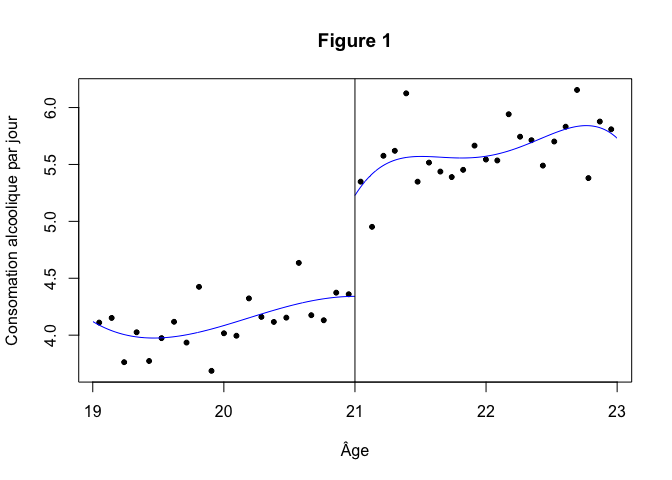

   
# Données simulées

Le code pour les données simulées est basé sur le [Guide de Style R](https://google.github.io/styleguide/Rguide.xml) créé par Google avec quelques modifications pour faciliter l'utilisation du fichier sous R et Stata. 

### Différences de différences

Nous simulons 2 bases de données pour le chapitre "Utilisation de méthodes quasi expérimentales pour évaluer l’effet de l’âge légal minimum pour la consommation d'alcool sur la mortalité accidentelle chez les jeunes."   

La première base de données est créée pour l'analyse "différences de différences." Cette base donnée et les analyses sont inspirées de l'étude XXXX.

Nous estimons les variables suivantes pour notre analyse simulée: 

1. **effetEtat**: Effet le l'état sur le nombre de consommations par semaine
2. **effetIndividu**: L'effet individuel 
3. **effetTemps**: L'effet du temps sur la variable d'intérêt
4. **tempsXetat**: L'effet de l'interaction entre le temps et l'état
5. **consParSem**: Le nombre de consommations par semaine
6. **temps**: Une variable qui indique le temps avant et après la politique


```r
library(car)
```

```
## Loading required package: carData
```

```r
library(ggplot2)

## Nombre de groupe par catégorie (État, individus, temps)
nEtat = 20
nInd = 1000
temps = 2

## Création des variables 
set.seed(100) 
etat <- rnorm(nEtat)*2
effetIndividu <- rnorm(nInd*nEtat)*3
effetTemps <- c(1, 2, 3, 4)
tempsXetat <- effetTemps*etat
age <- runif(1000,16,25)

## Création de la base de données
did = data.frame(etatID = rep(1:nEtat, each=nInd),
                  effetEtat = rep(etat, each=nInd),
                  individuID = 1:(nInd*nEtat),
                  connaisance = effetIndividu, 
                  effetTemps = rep(effetTemps, each=nEtat), 
                  erreur = rnorm(10000, 10, 5),
                  age = age)

did$loi <- recode(did$etatID, "lo:10=0; 11:hi=1;")

## Création de la variable dépendante (outcome) 
did$consParSem <- did$loi*-8 + did$effetEtat + did$effetTemps*-0.1 + did$erreur
did$consParSem <- car::recode(did$consParSem, "lo:0=0;")
did$consParSem <- as.integer(did$consParSem)

did$effetEtat <- NULL
did$tempsXetat <- NULL
did$erreur <- NULL

did$effetTemps <- recode(did$effetTemps, "1='2009'; 3='2010'; 2='2011'; 4='2012';")

## Création de la variable province. Il y a trois provinces dans notre pays fictifs ##

did$region <- recode(did$etatID, "1:6='region1'; 7:13='region2'; 14:20='region3';")

write.csv(did, "did.csv")
```

### "Regression discontinuity"

La seconde base de données est créée pour l'analyse "regression discontinuity." Cette base donnée et les analyses sont inspirées de l'étude Carpenter, C. et Dobkin, C. (2009) [The Effect of Alcohol Consumption on Mortality: Regression Discontinuity Evidence from the Minimum Drinking Age](https://www.aeaweb.org/articles.php?doi=10.1257/app.1.1.164). American Economic Journal: Applied Economics. 1:1, 164-192.

Nous estimons les variables suivantes pour notre analyse simulée: 

1. **id**: Indentification unique pour chaque participant
2. **âge**: L'âge du participant en mois
3. **propAlcJour**: Proportion de consommation alcoolique par jour
4. **mort100K**: Mort par 100,000 personnes-années
5. **mort100KAuto**: Mort par collision de véhicules automobiles par 100,000 personnes-années


```r
library(rdrobust)
library(car)

## Indentification du participant
id <- sample(1:1000, 1000, replace=FALSE)

## set.seed est...
set.seed(100) 

# Échantiloné 1000 d'une distribution uniforme ou la valeur minimale est 19 et la valeur maximale est 23 pour créer une variable d'age
age <- runif(1000,19,23) 

## Généré une variable fruit et légume par jour

fruit <- rnorm(1000,5,2) 
fruit <- car::recode(fruit, "lo:0=0;")

cigarette <- rnorm(1000,0.2,5) 
cigarette <- car::recode(cigarette, "lo:0=0;")

# Généré une régression avec 1000 échantillons d'une distribution normale ou l'intercepte est 0.2, la pente (bêta) est 0.2, et la différence réelle  au point de la discontuinté est 1. Ceci crée valeur du nombre de consommations alcoolique par jour.
propAlcJour <- 0.2+0.2*age+1*(age>=21)+rnorm(1000) 

## Figure 1. Relation entre l'âge et la proportion de consommation alcoolique par jour
rdplot(propAlcJour, age, c=21, title = "Figure 1", y.label = "Consomation alcoolique par jour", x.label = "Âge")
```

<!-- -->

```r
## Variable dichotomique avant (0) et après (1) l'âge de majorité

dAge <- recode(age, "19:21=0; 21:23=1")

## Création de la base de données finale pour l'analyse
rd <- data.frame(id, age, propAlcJour, dAge, fruit, cigarette)

write.csv(rd, "rd.csv")
```
